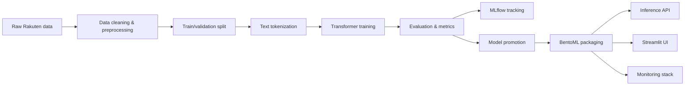

# Rakuten Multimodal Product Classifier

[](#)
[](#)
[](#)
[](#)
[](#)
[](#)
[](#)
[](#)

> A production-oriented multimodal e-commerce classification pipeline for predicting the Rakuten product category (`prdtypecode`).

## Overview

This repository contains an end-to-end machine learning system for classifying Rakuten products into **27 product categories**.
The production model currently focuses on **text-based classification** using:

- `designation`
- `description`

Product images are available in the dataset, but are not used in the current production path because they added limited incremental value compared to the additional training and inference cost.

## What This Project Covers

- Data processing and train/validation splitting
- Text classification with Hugging Face Transformers
- Experiment tracking with MLflow and DagsHub
- Reproducible pipelines with DVC
- Model evaluation and promotion
- Model serving with BentoML
- Interactive UI with Streamlit
- Containerized execution with Docker Compose
- Workflow automation with Airflow
- Monitoring with Prometheus, Grafana, and Evidently

## Project Goals

- Predict the correct `prdtypecode` for each product
- Return confidence scores and top-k predictions
- Provide reproducible training and inference workflows
- Support local development and production-style deployment

## ML Workflow



## Repository Structure

```text
rakuten-project/
├── artifacts/                 # DVC artifacts (splits, models)
├── configs/                   # Experiment and model configurations
├── data/                      # Raw and processed data
├── dags/                      # Airflow DAGs
├── docker/                     # Docker and service-specific container setup
├── logs/                       # Runtime logs
├── models/                     # Saved model artifacts
├── monitoring/                # Prometheus / Grafana / Evidently
├── nginx/                     # Reverse proxy configuration
├── plugins/                   # Airflow or platform plugins
├── results/                    # Reports and experiment outputs
├── src/
│   ├── data/                  # Data ingestion and cleaning
│   ├── evaluation/            # Evaluation and reporting
│   ├── inference/             # Single and batch inference
│   ├── models/                # Model definitions and helpers
│   ├── pipeline/              # End-to-end pipeline orchestration
│   ├── serving/               # BentoML service implementation
│   └── training/              # Training and MLflow logic
├── streamlit/                 # Streamlit application
├── tests/                     # Automated tests
├── Makefile                   # Unified command interface
├── bentofile.yaml             # BentoML build configuration
├── dvc.yaml                   # DVC pipeline stages
├── dvc.lock                   # DVC lock file
├── params.yaml                # DVC parameters
├── docker-compose.yaml        # Main compose file
├── docker-compose.base.yaml   # Base compose configuration
├── docker-compose.prod.yaml   # Production compose configuration
├── pyproject.toml             # Project metadata and dependencies
├── requirements.txt           # Optional pip dependency list
├── setup.sh                   # Environment bootstrap script
├── uv.lock                    # Locked dependency state for uv
└── README.md
```

## Screenshots

> Dummy placeholders for documentation. Replace these with real screenshots when available.

### Training Dashboard

```text
./docs/images/training-dashboard.png
```

### Streamlit Prediction UI

```text
./docs/images/streamlit-ui.png
```

### BentoML API Response

```text
./docs/images/api-response.png
```

## Requirements

- Python 3.11+
- [uv](https://docs.astral.sh/uv/)
- Docker
- Docker Compose
- Make

## Quickstart

### 1) Clone the Repository

```bash
git clone <your-repo-url>
cd rakuten-project
```

### 2) Install Dependencies

```bash
uv lock
uv sync --all-extras
```

### 3) Activate the Environment

```bash
source .venv/bin/activate
```

### 4) Run Initial Setup (Validate `.env`)

```bash
make setup
```

Optional validation-only step:

```bash
make check-env
```

### 5) Start the Development Stack

```bash
make dev-up
```

### 6) Run a Text Training Experiment

```bash
make train-text-run
```

### 7) Evaluate a Model (MLflow Run ID)

```bash
make evaluate MLFLOW_ID=<run_id>
```

## Usage

### Development

Start the development services:

```bash
make dev-up
```

(Optional) Build the development environment and containerize Bento:

```bash
make dev-build
```

Stop them:

```bash
make dev-down
```

Restart them:

```bash
make dev-restart
```

View logs:

```bash
make dev-logs
```

### Training

Run a training experiment (text-only):

```bash
make train-text-run
```

Run fine-tuning:

```bash
make finetune
```

View logs (dev stack):

```bash
make dev-logs
```

### Evaluation

Evaluate a trained model by MLflow run ID:

```bash
make evaluate MLFLOW_ID=<run_id>
```

Optional parameters:

- `X_DATA`: `data/processed/val.csv`
- `Y_DATA`: `data/processed/val.csv`
- `WEIGHTS`: `models/best_text_model.pt`
- `ENCODING`: `configs/label_encoding.json`

### Inference

Model inference/serving is handled via the BentoML + Docker Compose setup (see `docker-compose*.yaml` and BentoML configuration). In this Makefile, the focus is on training/evaluation and BentoML packaging.

### Model Promotion & BentoML

Sync the latest MLflow model to the BentoLocal store:

```bash
make sync-bento
```

Build the Bento bundle:

```bash
make build-bento
```

Containerize the Bento bundle into a Docker image:

```bash
make containerize-bento
```

### Serving
Model serving is handled via BentoML + Docker Compose. This Makefile version focuses on training/evaluation and BentoML packaging targets; start inference services using the relevant `docker-compose*.yaml` and BentoML configuration.

### Infrastructure
This Makefile version does not expose “infra-*” targets. Use `docker compose` directly with the relevant compose files if you need infrastructure services.

### Production

Start the production stack:

```bash
make prod-up
```

Stop production services:

```bash
make prod-down
```

View production logs:

```bash
make prod-logs
```

### Monitoring

This repository version does not expose “monitoring” targets via the Makefile. Use `docker compose` with the relevant compose files and/or the configuration in `monitoring/`.

### Utilities

Show all commands:

```bash
make help
```

## API Example

The BentoML service exposes a prediction endpoint that accepts product text and returns the predicted category and confidence scores.

### Request

```json
{
  "text": "Jeu vidéo action PS4"
}
```

### Response

```json
{
  "prediction": "2463",
  "confidence": 0.94,
  "top_k": [
    {"label": "2463", "score": 0.94},
    {"label": "2403", "score": 0.03},
    {"label": "2464", "score": 0.02}
  ]
}
```

### cURL Example

```bash
curl -X POST http://localhost:3000/predict   -H "Content-Type: application/json"   -d '{"text":"Jeu vidéo action PS4"}'
```

## Configuration

Key configuration files:

- `configs/` for experiment settings and label encoding
- `params.yaml` for DVC parameters
- `dvc.yaml` for pipeline stages
- `bentofile.yaml` for BentoML build configuration
- `docker-compose*.yaml` for local and production orchestration
- `monitoring/` for Prometheus, Grafana, and Evidently configuration

## Monitoring & Observability

The project includes a monitoring stack to support operational visibility:

- **Grafana** for dashboards and metrics visualization
- **Prometheus** for metric collection and alerting
- **Evidently** for model and data quality monitoring

## Testing

Run the test suite:

```bash
pytest
```

## Notes

- The current model is text-first by design.
- Image features are intentionally excluded from the production path for efficiency.
- The project is organized to support reproducibility, traceability, and deployment readiness.

## License

This project is intended for educational and portfolio use. Add a license if you plan to publish or distribute it publicly.

